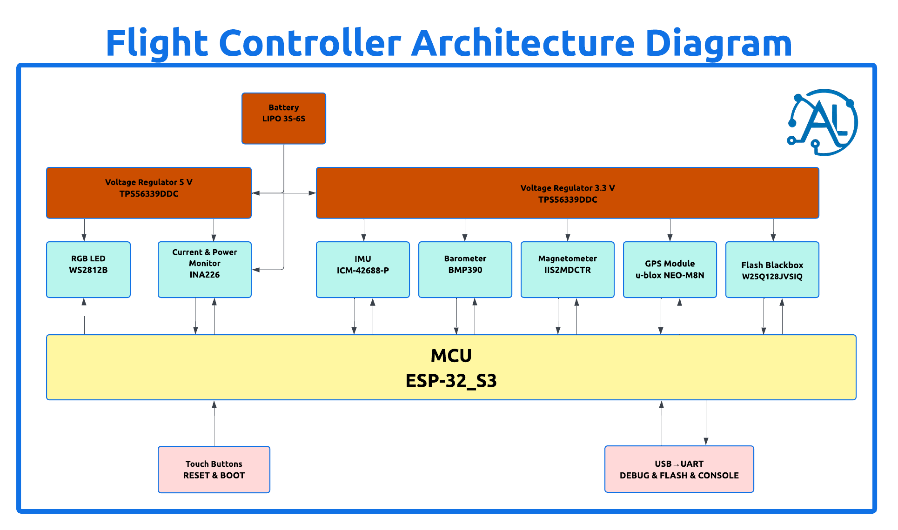
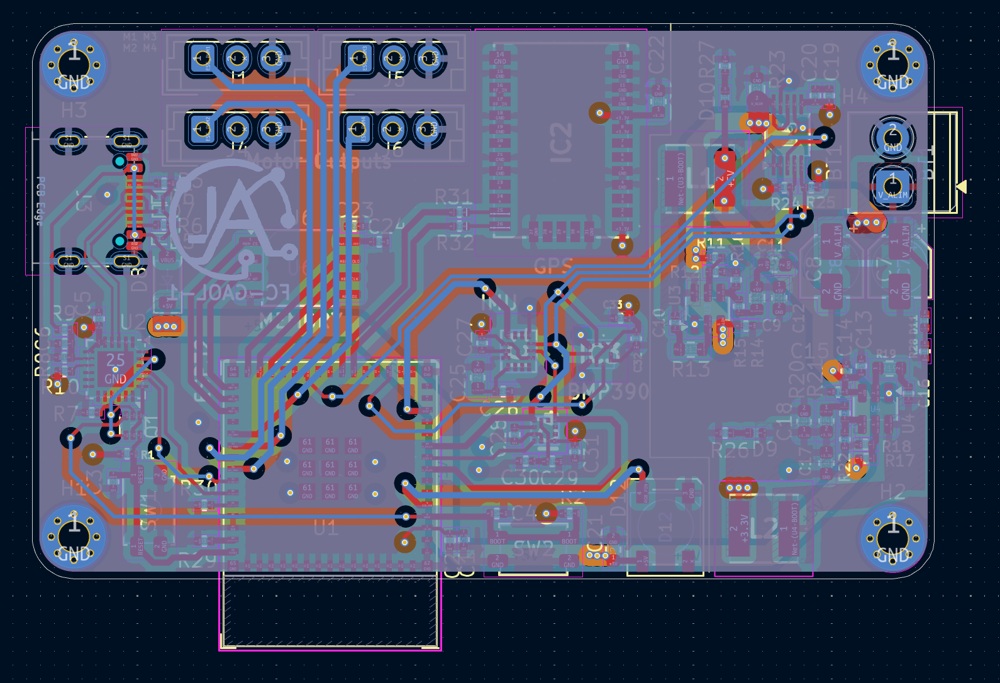
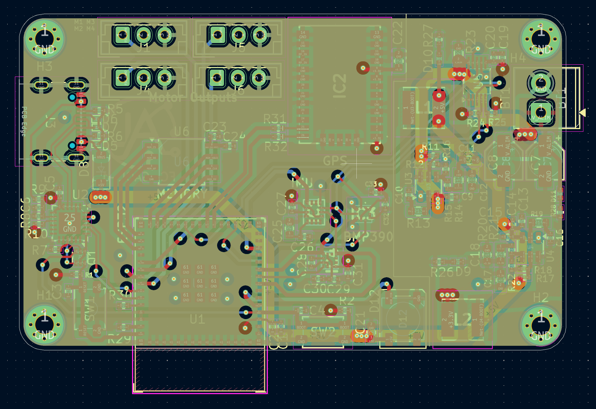
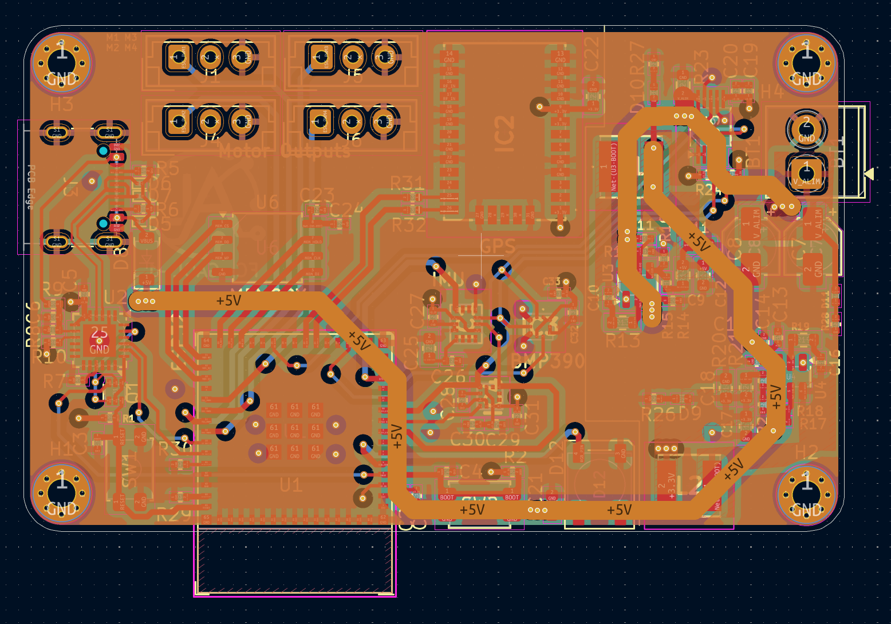
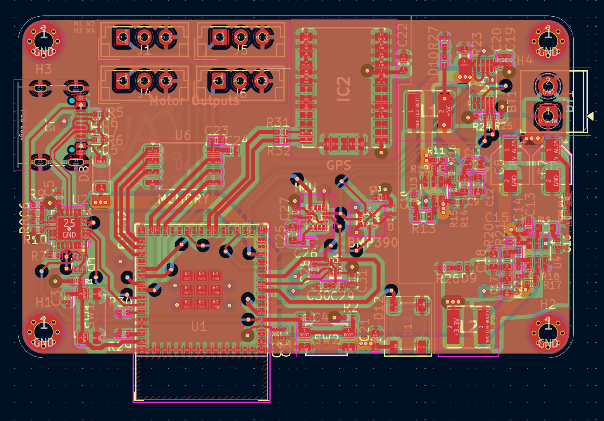
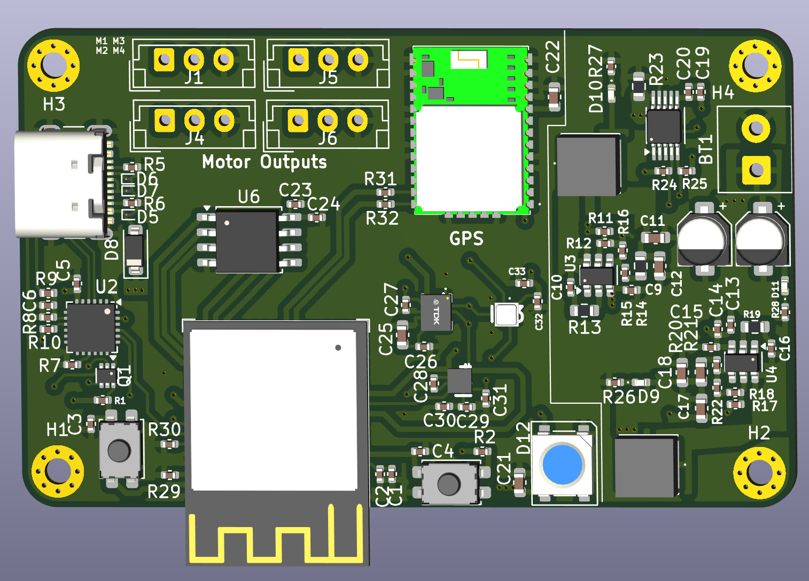
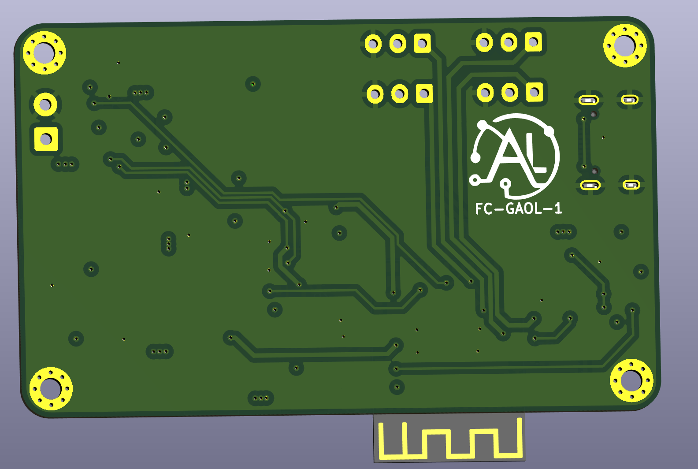

# Flight-Controler

## Description du projet 
Ce projet personnel a pour objectif de développer un contrôleur de vol basé sur un microcontrôleur ESP32, intégrant divers capteurs et actionneurs. Le développement a été réalisé au cours du mois d'août 2025, en utilisant KiCad pour la conception du PCB.

## Schema 

## Resultat
   
 

